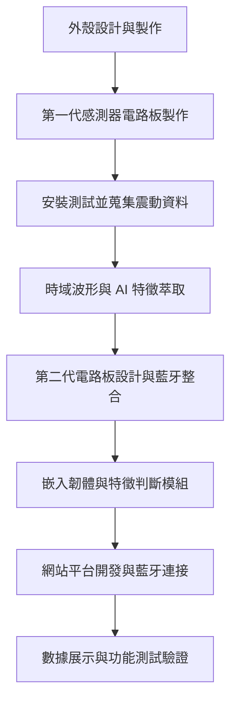

# 感測器系統開發專案書

## 一、硬體設計與製作

### 1. 感測器外殼設計與安裝

- 外殼由團隊自行設計與製作，根據實際場域環境及機械製造技能配置。
- 安裝位置距離虎鉗約 10 公分左右，避免授其餘共振干擾。
- 
- 透過螺絲與 T 型螺栓固定於 T 型溝槽，確保穩固性。
- 
- 採用上下兩片式結構，具有公母凸緣設計，利於定位與組裝。
- 
- 接縫處填充樹脂，增強防水功能。
- 
- 尺寸預留電路板邊緣空間約 ±15 mm。

### 2. 感測電路板開發

- 以 EasyEDA 軟體進行 PCB layout 與元件配置，並參考學長經驗進行開發。
- 第一版：完成基本震動感測功能。
- 
- 第二版：新增藍牙模組以支援無線傳輸與線上監測。
- 持續進行數據除錯與穩定性驗證。

---

## 二、軟體開發與驗證

### 1. 韌體開發

- 利用第一代感測器所蒐集的震動資料，進行特徵萃取與 AI 分析。
- 將震動資料轉換為時域波形圖，提取關鍵特徵。
- 嵌入特徵判斷演算法至第二代感測器處理器，實現即時判斷。
- 感測器安裝需盡量靠近目標震動源，提升感測準確度。

### 2. 網站平台開發

- 建置網站平台以連接第二代感測器藍牙模組。
- 即時顯示感測器上傳數據，檢查特徵提取與傳輸是否正確。
- 作為後續系統驗證、除錯與使用者互動介面。

---

## 三、開發流程圖

---

## 四、編輯記錄過程
[點我系統架構說明](https://chatgpt.com/share/683563a0-fe04-800e-adc7-0d2ccc51ab11)
